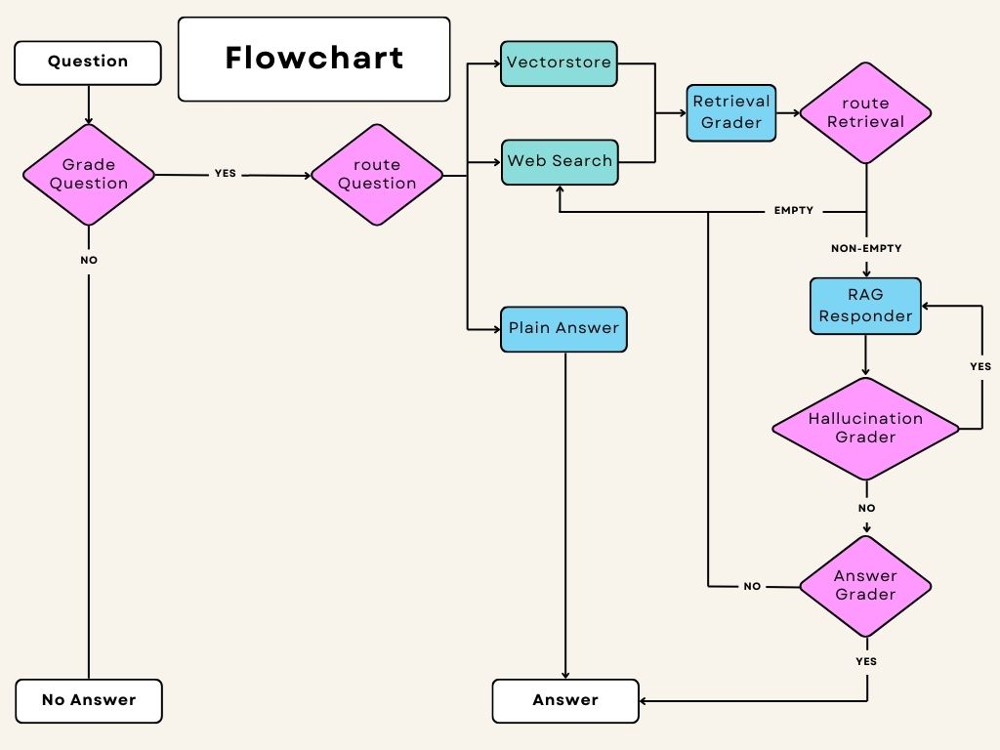

# LangGraph with RAG

這是一個結合 LangGraph 和 RAG (Retrieval-Augmented Generation) 的問答系統，專門處理與交通法規相關的問題。

## 系統架構



### 主要流程

1. **問題評估 (Grade Question)**
   - 評估問題是否適合回答（過濾不當內容）
   - 如果問題合適，進入路由階段

2. **問題路由 (Route Question)**
   - 根據問題內容決定使用哪種資料來源：
     - Vectorstore：用於交通法規相關問題
     - Web Search：用於一般性問題
     - Plain Answer：直接使用 LLM 回答

3. **資料檢索 (Retrieval)**
   - Vectorstore：從本地向量資料庫檢索相關文件
   - Web Search：使用 Tavily 搜尋網路資訊

4. **檢索評分 (Retrieval Grader)**
   - 評估檢索到的文件是否與問題相關
   - 如果沒有相關文件，可能會重試或轉向其他方式

5. **回答生成 (RAG Responder)**
   - 使用 RAG 技術生成回答
   - 包含幻覺檢查和答案品質評估

## 專案結構 

```
LangGraph_with_RAG/
├── config/ # 配置文件
│ └── config.py # API 金鑰和環境設定
├── data/ # 資料處理
│ └── data.py # 資料載入和向量資料庫建立
├── models/ # 資料模型
│ └── state.py # 狀態定義
├── nodes/ # 工作流程節點
│ ├── generators.py # 回答生成
│ ├── graders.py # 評分和路由
│ └── retrievers.py # 資料檢索
├── services/ # 核心服務
│ ├── embeddings.py # 向量嵌入
│ ├── llm.py # LLM 服務
│ └── llm_model.py # LLM 模型定義
└── docs/ # 文檔
└── images/ # 圖片資源
```

### 主要組件說明

#### 1. 核心服務 (services/)
- **llm.py**: 提供 Azure OpenAI 
- **embeddings.py**: 處理文件向量化
- **llm_model.py**: 定義各種 LLM 評分和路由模型

#### 2. 工作流程節點 (nodes/)
- **generators.py**: 實現 RAG 和一般回答生成
- **graders.py**: 處理問題評估、路由和品質控制
- **retrievers.py**: 實現向量檢索和網路搜尋

#### 3. 資料處理 (data/)
- **data.py**: 負責載入 PDF 文件和建立向量資料庫

## 特色功能

1. **多重資料來源整合**
   - 本地向量資料庫（交通法規文件）
   - Tavily 網路搜尋（即時資訊）
   - LLM 直接回答（一般性問題）

2. **完整的品質控制機制**
   - 問題內容過濾
   - 檢索結果相關性評分
   - 幻覺檢測
   - 答案品質評估
   - 智能重試機制

3. **智能路由系統**
   - 根據問題類型自動選擇最適合的資料來源
   - 失敗時自動切換到備選方案
   - 最多重試一次，確保回應效率

## 安裝與使用

1. 安裝依賴：
